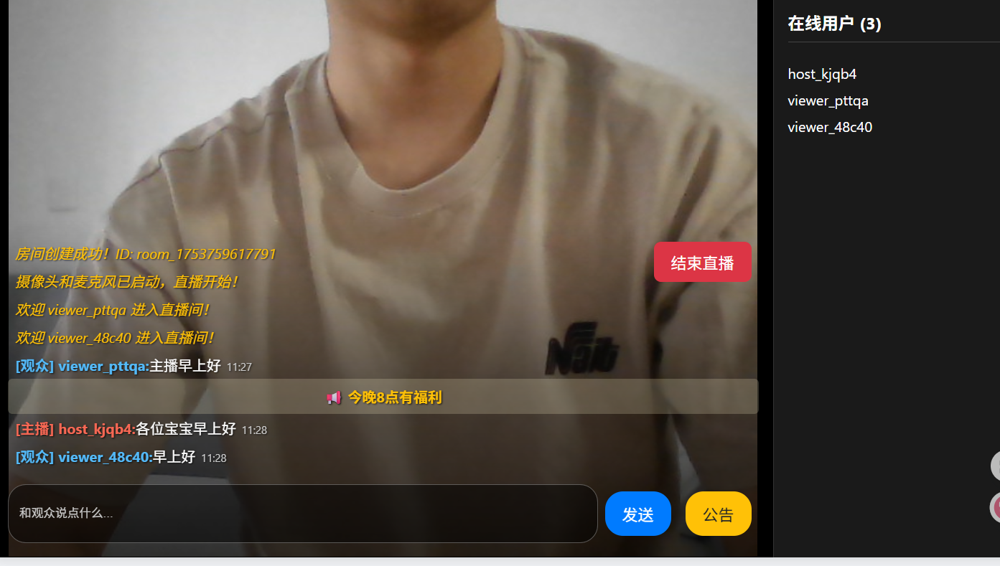
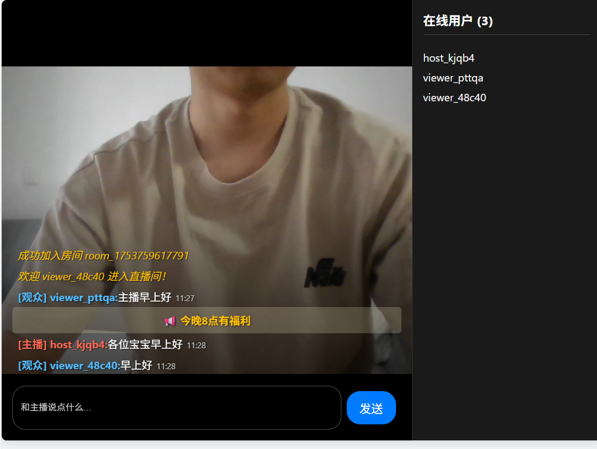
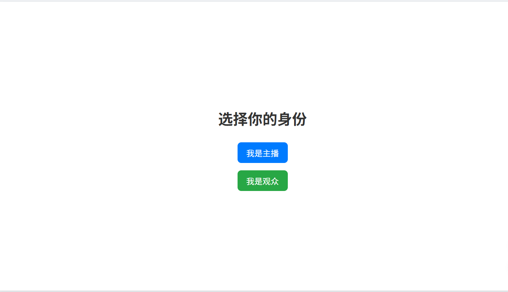
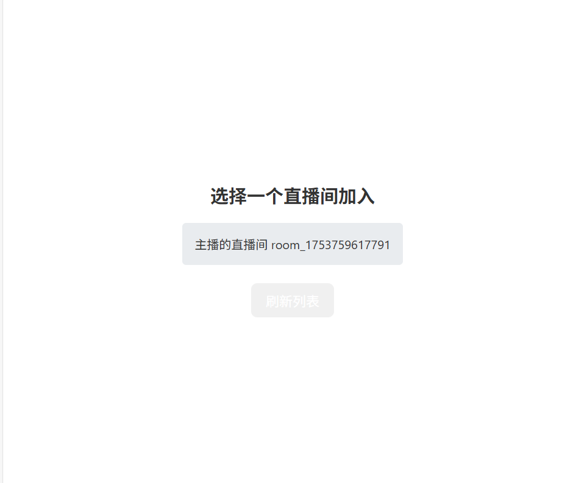
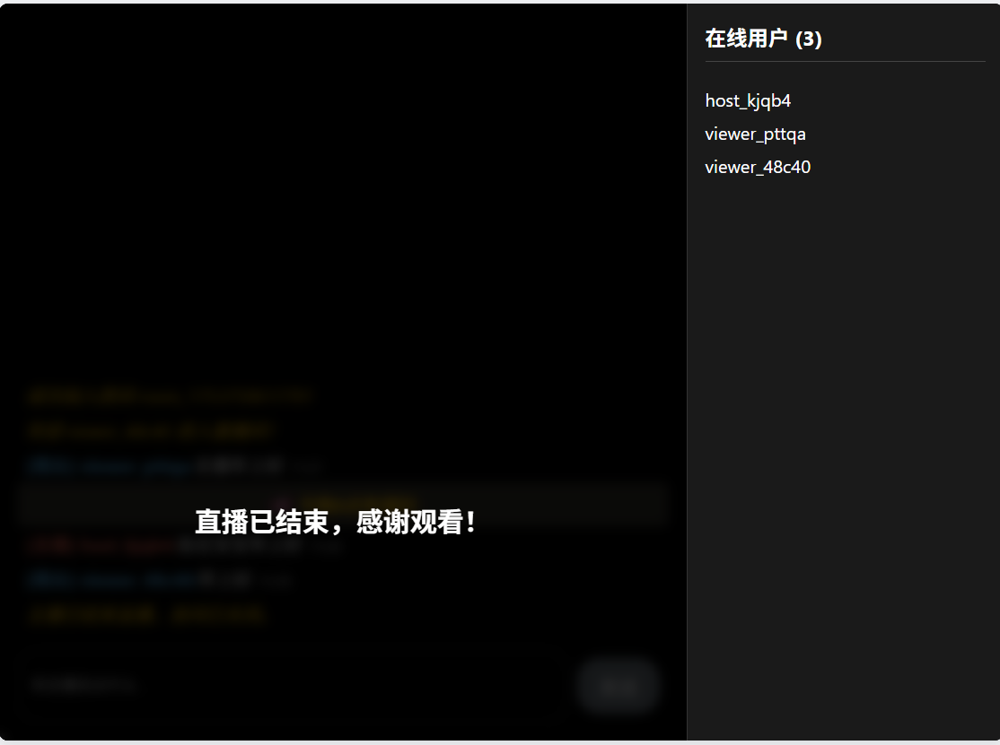

# 我的直播小项目：一个 WebRTC + WebSocket 的实验

这个项目算是我自己探索实时通信技术的一个记录。一开始我的目标很简单：就是想用 Node.js 和原生的 WebSocket 从零搭一个聊天室，不想用 Socket.IO 这种把底层细节都藏起来的库。

后来，聊天室做完了，我就想能不能更进一步，加上视频直播？于是我开始研究 WebRTC，最终把这两者结合了起来。下面就是这个应用跑起来的样子：



## 主要功能

这个 App 分为“主播”和“观众”两个角色，实现了一个基础的直播流程。

### 1. 音视频直播 (基于 WebRTC)

主播可以创建直播间，应用会请求摄像头和麦克风权限，并将实时画面通过 WebRTC 推送给所有观众。观众加入后，就能看到主播的音视频流。

| 主播端视角 | 观众端视角 |
| :---: | :---: |
|  |  |

这是整个项目的核心，我学到了：
*   **媒体协商:** 怎么通过 `getUserMedia` 获取设备权限，并创建一个 `MediaStream`。
*   **信令交换:** WebRTC 本身不负责通信，需要一个信令服务器。我用 WebSocket 来传递 `offer`, `answer` 和 `ice candidate` 这些信息，为主播和每一个观众建立起 P2P 连接。

### 2. 实时弹幕聊天 (基于 WebSocket)

在看直播的同时，观众和主播可以实时聊天。我花了不少心思在 UI 上，让弹幕能像主流直播平台一样，直接覆盖在视频上，并且清晰可读。

*   **聊天浮层:** 用 CSS 的 `position: absolute` 和渐变背景，让聊天区浮在视频底部。
*   **消息流:** 消息列表是反向的 (`flex-direction: column-reverse`)，新消息会从底部弹出，更符合直觉。
*   **文字清晰度:** 给白色的弹幕文字加上了黑色的 `text-shadow`，这样不管视频背景多花，字都能看清。

## 应用流程

| 1. 选择身份 | 2. 观众选择房间 | 3. 结束直播 |
| :---: | :---: | :---: |
|  |  |  |

## 怎么跑起来

### 环境准备

你需要先安装 Node.js 和 npm。

### 安装步骤

1.  把项目克隆到本地：
    ```bash
    git clone https://github.com/535601882/WebSocket-example.git
    cd WebSocket-example
    ```

2.  安装依赖：
    ```bash
    npm install
    ```

### 启动

1.  **启动服务器：**
    ```bash
    node server.js
    ```
    看到提示“服务器已启动，正在监听 http://localhost:3000”，就说明成功了。

2.  **打开 App：**
    在浏览器里打开 `http://localhost:3000`。

3.  **试试看：**
    *   打开一个浏览器标签页，选择“我是主播”。
    *   点击按钮开始直播。**这时浏览器会请求摄像头和麦克风权限，一定要点“允许”。**
    *   再打开一个（或多个）标签页，选择“我是观众”。
    *   你应该能看到主播的房间，点击加入，稍等片刻就能看到视频了。

## 一些限制和未来的想法

这毕竟只是个学习项目，离真正的线上产品还有距离。下面这些是我想到的问题和未来可以做的事：

*   **需要 TURN 服务器：** WebRTC 在本地网络里跑得很顺畅，但要是在复杂的公网环境（比如用户在不同的路由器后面），就需要一个 TURN 服务器来帮忙转发视频流量。这个项目里我还没配置。
*   **没有正经的用户系统：** 现在的用户名都是随机生成的，下一步可以加上真正的登录注册功能。
*   **聊天记录不保存：** 聊天消息是临时的，一刷新就没了。

---

希望这个项目能让你觉得有点意思。对我来说，这是一个搞懂直播技术背后原理的有趣过程。
